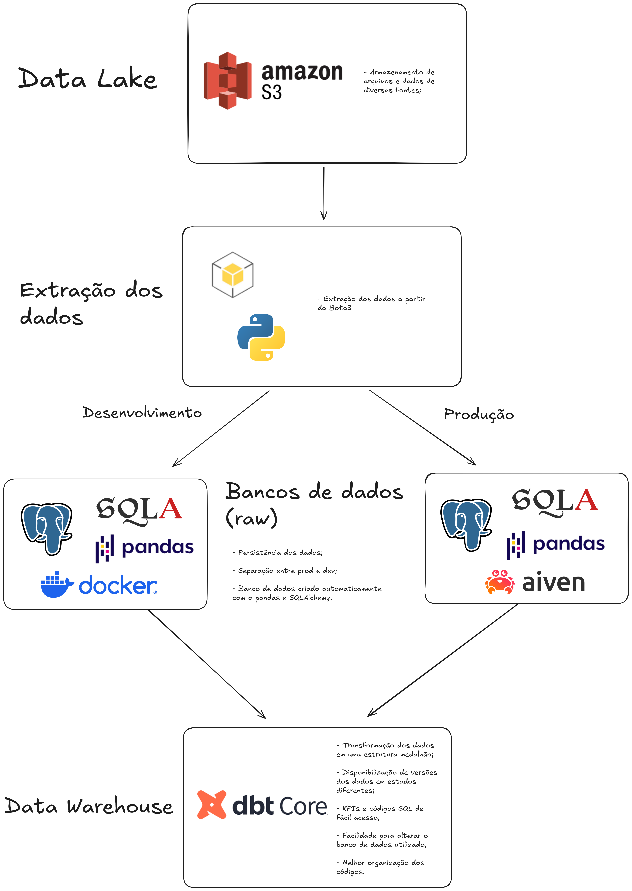

# 📊 Engenharia de Dados para E-commerce


---

## 🔍 Visão Geral do Projeto

Projeto voltado à **Engenharia de Dados aplicada a um e-commerce**, com foco na **estruturação, integração e transformação de dados para fins analíticos**.

Ter uma **modelagem de dados limpa, organizada e confiável** deixou de ser um diferencial e passou a ser uma **necessidade estratégica**, principalmente para empresas do setor de **e-commerce**.  
Este projeto foi desenvolvido com base em um **problema real de negócio**, simulando desafios encontrados no mercado.

---

## 🧠 Problema de Negócio

Nossa loja de e-commerce está em ascensão em vendas de produtos, registrando um número cada vez maior de dados em diversos sistemas da empresa. No entanto, os dados das diversas fontes não estão padronizados em um único sistema, além da falta de direcionamento de ações contra concorrentes de mercado.

Esses problemas, que à primeira vista parecem pequenos, gerou alguns resultados negativos silenciosos:

- **Integração** de dados ineficiente
O que gera problemas de análises da empresa como um todo, afetando diretamente os resultados financeiros e de mercado.

- **Transformação** perigosa dos dados
A falta de transformação clara e segura dos diferentes tipos de nuances nos dados é um risco altíssimo para as análises da empresa.

- **Fluxo** dos dados confusos para consumo
A empresa não tem uma organização dos níveis para os dados, afetando a criação de KPIs valiosos, além de riscos em mexer nos dados brutos diretamente.

- **Preços** de produtos sem estratégias de mercado
A falta de uma extração de dados dos concorrentes para saber seus preços de produto tem dificultado muito as vendas da loja virtual.

**Problema central**: falta de integração e transformação eficiente dos dados, prejudicando todas as áreas da empresa, seja por falta de análise, quanto por perigos de segurança.


---

## 🎯 Objetivos de Negócio

Este projeto tem como objetivo:

- **Integrar dados** em uma única fonte confiável; 
- **Extrair dados externos** para análises comparativas de mercado; 
- **Transformar e arquitetar os dados** para consumo seguro e eficiente.   

---

## 🛠️ Solução Técnica

O projeto explora conceitos fundamentais da **Engenharia de Dados**, com destaque para:

- **Consolidação de dados**
- **Arquitetura ELT (Extract, Load, Transform)**

### 📦 Data Lake

A consolidação dos dados é feita em um **Data Lake na AWS S3**, escolhido por oferecer:

- **Alta escalabilidade**
- **Excelente custo-benefício**
- **Integração nativa com serviços AWS**, como Athena e Redshift


### 🔄 Pipeline ELT

A arquitetura ELT foi dividida em etapas:

- **Extract**  
  Utilização de **Python** com a biblioteca **Boto3** para extração e manipulação dos dados no S3.

- **Load & Transform**  
  Implementação de uma **arquitetura medalhão** (Bronze, Silver, Gold) utilizando **dbt-core**, permitindo:
  - Persistência segura
  - Transformações versionadas
  - Criação de **KPIs na camada Gold**


### 🗄️ Bancos de Dados

Foram definidos dois ambientes:

- **Desenvolvimento**  
  PostgreSQL em **container Docker**, facilitando testes e validações locais

- **Produção**  
  PostgreSQL hospedado na **Aiven**, escolhido pelo suporte avançado a:
  - JSON
  - Tipos de dados complexos
  - Alta disponibilidade

---

## 🔁 Fluxo da Solução




> **OBS:** fluxo sujeito a mudanças e melhorias futuras.

---

## 📈 Resultados da Aplicação

Mesmo em desenvolvimento, os resultados esperados são claros:

- **Melhor tomada de decisão** com dados consolidados;
- **Precificação inteligente** baseada em concorrentes; 
- **Transformações seguras e auditáveis**;
- **KPIs de fácil acesso**, reduzindo retrabalho de analistas e cientistas; 
- **Inovação tecnológica**, aumentando a atratividade para investidores.

---

## ▶️ Como Utilizar a Solução

### ✅ Pré-requisitos

Recomenda-se criar um ambiente virtual:

```bash
conda create --name nome_do_ambiente
```

Caso não tenha o Anaconda instalado: https://www.anaconda.com/download

### 📥 Instalação

Clone o repositório:

```
git clone <URL_HTTPS_DO_REPOSITORIO>
```

Abra o projeto em uma IDE que interprete a linguagem Python.

Instale as dependências:

```
pip install -r requirements.txt
```

### 🚀 Execução

Execute o pipeline:

```
python data_ingestion/load_data.py
```

### ⚠️ Observações

- É necessário possuir um bucket no AWS S3;

- Configure as credenciais no arquivo: extract_data.py;

- O projeto está em evolução, especialmente a parte de dbt-core;

- Utilize dois bancos PostgreSQL (dev e prod);

- Configure corretamente as credenciais de cada ambiente.

---

## 🧰 Tecnologias Utilizadas
### Linguagens:

- Python

- SQL

### Cloud:

- AWS S3

- Boto3

### Transformação e Persistência:

- Pandas

- SQLAlchemy

- dbt-core

- Banco de Dados

- PostgreSQL

- Docker

---

## 🕛 Futuras implementações

Mesmo criando uma base muito boa dentro da Engenharia de Dados com esse projeto, quero expandir ainda mais meus conhecimentos. Prentendo adicionar algumas funções no futuro:

- **Orquestração de pipeline** com Apache Airflow;
- **Automação de Mensagens** com o n8n.

---

## 🙏 Agradecimentos

Agradeço à Jornada de Dados por disponibilizar um curso gratuito de alta qualidade, que serviu como base para o desenvolvimento deste projeto.

## 📜 Certificado de Conclusão


